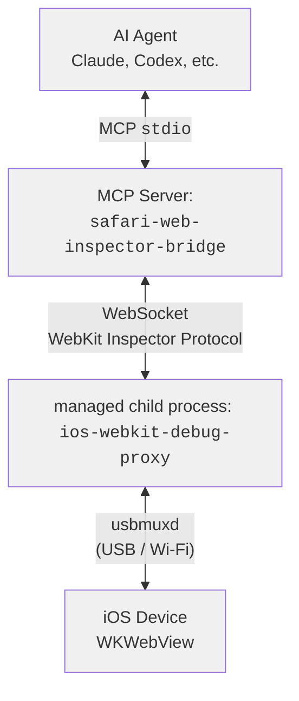
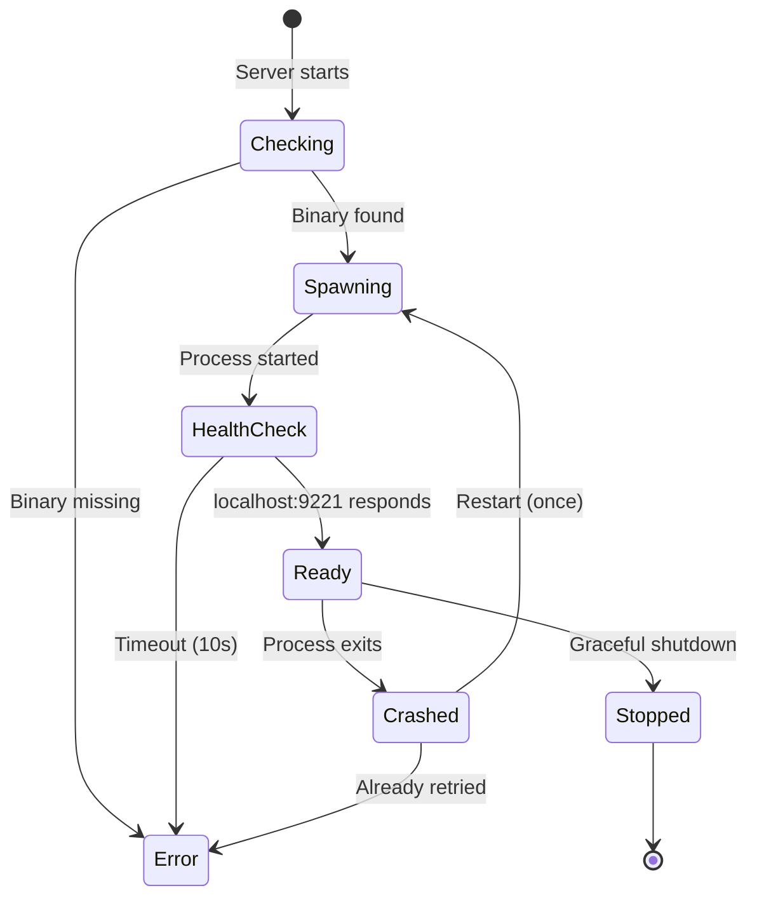
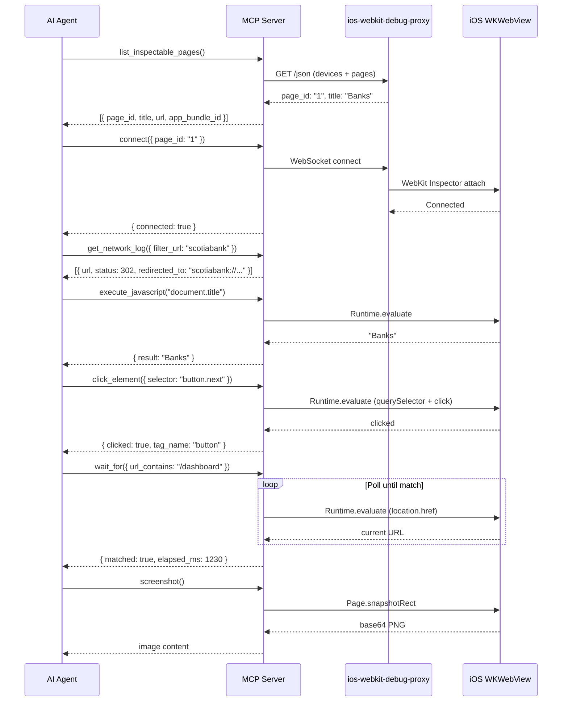

# Safari Web Inspector Bridge

Safari Web Inspector Bridge is an MCP server that gives AI agents the same capabilities a developer gets from Safari Web Inspector — inspect, observe, and automate WKWebViews running on connected iOS devices.

## Architecture



The server spawns `ios-webkit-debug-proxy` as a child process, connects to the WebKit Inspector Protocol over WebSocket, and exposes everything as MCP tools. The proxy is managed for its full lifecycle -- started on init, health-checked, auto-restarted on crash, and killed on shutdown.

### Proxy Lifecycle



### 14 MCP Tools

**Discovery:** `list_devices` | `list_inspectable_pages` | `connect`

**Observation:** `get_url` | `get_dom` | `get_network_log` | `get_console_log` | `screenshot`

**Automation:** `navigate` | `execute_javascript` | `patch_css` | `click_element` | `type_text` | `wait_for`

> **Connection resilience:** the iOS Web Inspector socket drops on navigation and after idle periods. Tools transparently **reconnect to the last attached page** when that happens (`ensureConnection`), so an agent does not need to call `connect` again after every navigation. `wait_for url_contains` reconnects on each poll, since the socket most often drops during the very navigation being awaited. Capture buffers (network/console) reset on reconnect.

## Prerequisites

- **`macOS`** required for `usbmuxd` and iOS device connectivity
- **`ios-webkit-debug-proxy`**: `brew install ios-webkit-debug-proxy`
- **`iOS`**: Settings &rsaquo; Safari &rsaquo; Advanced &rsaquo; Web Inspector: enabled
- target app WKWebView must have `isInspectable = true`

## Installation

```bash
git clone https://github.com/andesco/safari-web-inspector-bridge.git
cd safari-web-inspector-bridge
npm install
npm run build
```

### Add to Claude Code

```bash
claude mcp add safari-web-inspector-bridge node /path/to/safari-web-inspector-bridge/dist/index.js
```

### Add to any MCP client

Add to your MCP configuration file:

```json
{
  "mcpServers": {
    "safari-web-inspector-bridge": {
      "command": "node",
      "args": ["/path/to/safari-web-inspector-bridge/dist/index.js"],
      "env": {
        "SWIB_NETWORK_CAPTURE": "true",
        "SWIB_CONSOLE_CAPTURE": "true"
      }
    }
  }
}
```

## Tools

### Device & Connection

| Tool | Parameters | Returns |
|------|-----------|---------|
| `list_devices` | _(none)_ | `[{ udid, name, os_version }]` |
| `list_inspectable_pages` | `device_udid?` string -- filter to one device | `[{ page_id, title, url, app_bundle_id, device_udid }]` |
| `connect` | `page_id` string -- from `list_inspectable_pages` | `{ connected, page_id, url, title, warnings? }` |

### Observation

| Tool | Parameters | Returns |
|------|-----------|---------|
| `get_url` | _(none)_ | `{ url }` |
| `get_dom` | `selector?` string -- CSS selector (default: `document.documentElement`); `outer_html?` boolean (default: `true`) -- outerHTML vs textContent | `{ html }` or `{ text }` |
| `get_network_log` | `clear?` boolean (default: `false`); `filter_url?` string -- regex; `filter_status?` string -- e.g. `"302"`, `"4xx"` | `[{ request_id, method, url, status, mime_type, response_headers, request_headers, redirected_from, redirected_to, timing, error }]` |
| `get_console_log` | `clear?` boolean (default: `false`); `level?` `"log" \| "warn" \| "error" \| "info"` | `[{ level, text, timestamp, source_url, line_number }]` |
| `screenshot` | _(none)_ | MCP image content (base64 PNG) |

### Automation

| Tool | Parameters | Returns |
|------|-----------|---------|
| `navigate` | `url` string | `{ url, title, status }` |
| `execute_javascript` | `expression` string; `await_promise?` boolean (default: `true`) | `{ result }` -- JSON-serialized return value |
| `patch_css` | `css` string -- empty removes; `id?` string (default: `swib-css-patch`) -- idempotent per id | `{ id, applied, bytes }` or `{ id, removed }` |
| `click_element` | `selector` string -- CSS selector; `index?` number (default: `0`) -- which match to click | `{ clicked, selector, tag_name }` |
| `type_text` | `text` string; `selector?` string -- focus this element first | `{ typed: true }` |
| `wait_for` | One of: `selector?` string, `url_contains?` string, `network_idle?` number (ms); plus `timeout_ms?` number (default: `10000`) | `{ matched: true, elapsed_ms }` |

## Configuration

| Env Var | Default | Description |
|---------|---------|-------------|
| `SWIB_AUTO_CONNECT` | `false` | Auto-connect to the first inspectable page on startup |
| `SWIB_NETWORK_CAPTURE` | `true` | Capture network requests on connect |
| `SWIB_CONSOLE_CAPTURE` | `true` | Capture console messages on connect |
| `SWIB_PROXY_PORT` | `9222` | Starting port for `ios-webkit-debug-proxy` device ports |

> [!note]
> `SWIB_NETWORK_CAPTURE` and `SWIB_CONSOLE_CAPTURE` default to `true` — set to `false` to disable.
> `SWIB_AUTO_CONNECT` defaults to `false` — set to `true` to enable.

## Example Workflow



## Roadmap / Possible Enhancements

Ideas captured for when they're needed. Roughly highest-leverage first.

### Android support (CDP over `adb`) — make it cross-platform
Android Chrome and the installed WebAPK speak the **Chrome DevTools Protocol**, which is nearly identical to the WebKit Inspector Protocol this server already drives (`Runtime.evaluate`, `Page.*`, target multiplexing). The transport differs: `adb forward tcp:9222 localabstract:chrome_devtools_remote`, then `http://localhost:9222/json` lists pages with CDP `webSocketDebuggerUrl`s. The layering already isolates this — add an `adb-manager` (in place of `proxy-manager`), CDP discovery (in place of `device-discovery`), and a CDP connection (a sibling of `webkit-connection`); the **entire `tools/*` layer reuses unchanged**. Only real per-backend difference: screenshots (`Page.captureScreenshot` in CDP vs `Page.snapshotRect` in WebKit). Result: one MCP that debugs the real installed app on both platforms. (Android is more open than iOS here — Playwright/`chrome-remote-interface` can also drive the same adb-forwarded port if a separate tool is preferred.)

### Lower per-call latency
- **Keep the socket warm / combined `connect`+`evaluate`**: today each tool round-trips through the proxy and the connection often needs re-establishing; a warm/persistent connection (now partly addressed by `ensureConnection`) plus a single-call "connect-and-evaluate" would cut the two-round-trip-per-step cost noticed in practice.
- **Batch tool**: evaluate several expressions / apply a CSS patch + screenshot in one call.

### Richer automation
- `patch_dom` / `set_attribute` / `set_value` companions to `patch_css` for live DOM tweaks.
- Real input events (coordinate `tap`, `key` events, `scroll`) via the protocol's input domain instead of synthetic DOM events.
- `type_text` currently sets `.value +=` and uses the deprecated `execCommand('insertText')`; **framework-controlled inputs (React/Vue) won't pick up the change** — use the native value setter + dispatch `input` so the framework's tracker updates.

### Robustness / correctness follow-ups
- `navigate` waits a fixed `500ms` after setting `location.href` (racy) — wait for `load`/readyState instead.
- Reconnect resilience is wired into `wait_for url_contains` but not the `selector` / `network_idle` branches.
- Capture buffers (network/console) reset on reconnect — optionally persist/merge across reconnects.
- Wi-Fi/network device support (`idevice_id -n` / CDP over network) for cable-free sessions.

### Diagnostics
- A one-shot **viewport report** tool (`visualViewport` scale/size, `env(safe-area-inset-*)` via a probe, `documentElement.client*`, `display-mode`, nav geometry). This combination repeatedly cracked iOS standalone quirks (the dynamic viewport starts at the small size and only expands to full screen after a scroll; the Android WebAPK reports `window.inner*` at ~1.9× the true CSS viewport — so always read `visualViewport`/`clientWidth`, never `window.inner*`). Worth a first-class tool rather than ad-hoc `execute_javascript`.

## Development

```bash
npm run build        # Compile TypeScript to dist/
npm run dev          # Watch mode (tsc --watch)
npm test             # Run tests (vitest)
npm run test:watch   # Watch mode tests
npm start            # Run the MCP server (node dist/index.js)
```

### Project structure

```
src/
  index.ts               # Entry point, server setup, lifecycle
  types.ts               # Interfaces and config loader
  proxy-manager.ts       # Spawns and manages ios-webkit-debug-proxy
  device-discovery.ts    # Queries proxy for devices and pages
  webkit-connection.ts   # WebSocket connection to WebKit Inspector Protocol
  network-buffer.ts      # Ring buffer for network request entries (1000 max)
  tools/
    shared.ts            # textResult/errorResult + connectToPage + ensureConnection (auto-reconnect)
    device-tools.ts      # list_devices, list_inspectable_pages, connect
    observation-tools.ts # get_url, get_dom, get_network_log, get_console_log, screenshot
    automation-tools.ts  # navigate, execute_javascript, patch_css, click_element, type_text, wait_for
```

